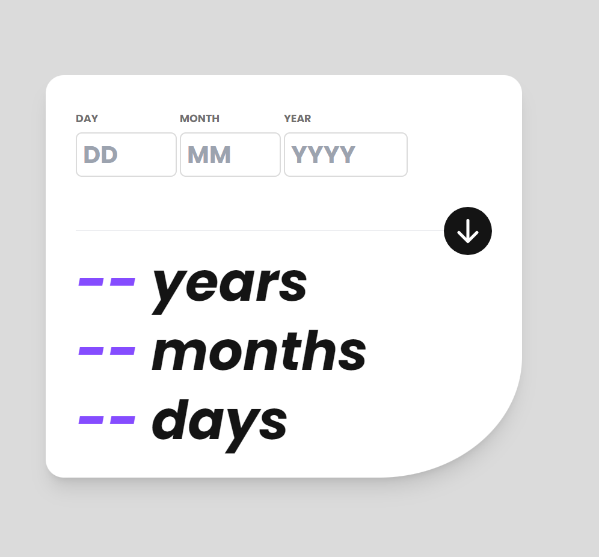

# Frontend Mentor - Age calculator app solution

This is a solution to the [Age calculator app challenge on Frontend Mentor](https://www.frontendmentor.io/challenges/age-calculator-app-dF9DFFpj-Q). Frontend Mentor challenges help you improve your coding skills by building realistic projects. 

## Table of contents

- [Overview](#overview)
  - [The challenge](#the-challenge)
  - [Screenshot](#screenshot)
  - [Links](#links)
- [My process](#my-process)
  - [Built with](#built-with)
  - [What I learned](#what-i-learned)
  - [Continued development](#continued-development)
- [Author](#author)
- [Acknowledgments](#acknowledgments)

**Note: Delete this note and update the table of contents based on what sections you keep.**

## Overview

### The challenge

Users should be able to:

- View an age in years, months, and days after submitting a valid date through the form
- Receive validation errors if:
  - Any field is empty when the form is submitted
  - The day number is not between 1-31
  - The month number is not between 1-12
  - The year is in the future
  - The date is invalid e.g. 31/04/1991 (there are 30 days in April)
- View the optimal layout for the interface depending on their device's screen size
- See hover and focus states for all interactive elements on the page
- See the age numbers animate to their final number when the form is submitted

### Screenshot



### Links

- Solution URL: [GitHub repo](https://github.com/JohnFScha/age-calculator-app)
- Live Site URL: [Deploy on vercel](https://age-calculator-app-ten-delta.vercel.app/)

## My process

I used this challenge to up my styling skills with Tailwind.css. This tools is very powerful as it enables you to customize you breakpoints for responsive behaviour. I set up a single small screen (mobile) breakpoint at max-width: 600px and tested it on even smaller breakpoints.

I ran into a common issue during development, as the calculated age was stored in a sibling component of the one which "printed" it. So my workaround that issue was setting up a siple React-Redux store, so I could access the calculated age state wherever I needed it. Compiling with Redux-Devtools is realy handy as you can keep track of how the state initializes and then see in real time which dispatched action updates it.

### Built with

- CSS Flexbox
- Mobile-first workflow
- [React](https://reactjs.org/) - JS library
- [Vite](https://vitejs.dev/guide/) - React framework
- [Tailwind.css](https://tailwindcss.com/docs/installation) - For styles
- [React-Redux](https://react-redux.js.org/introduction/getting-started) - For state management

### What I learned

As stated in the overview, tailwind provides a simple way of configuring your app's styles directly from it's config.js file. In the code below, I defined a personal breakpoint of 600px max width for applying styles:

```js
/** @type {import('tailwindcss').Config} */
export default {
  content: [
    "./index.html",
    "./src/**/*.{js,ts,jsx,tsx}",
  ],
  theme: {
    screens: {
      'mobile': {'max': '600px'},
      // => @media (max-width: 600px) { ... }
    }
  }
}
```
These breakpoints are later used inside the `className` property of the JSX, like so:

```jsx
<h2 className="text-7xl mobile:text-5xl ...">
```
Tailwind takes care of the rest!

<hr>

Another thing of note is the redux store:
```js
import { legacy_createStore } from 'redux';
import { composeWithDevTools } from 'redux-devtools-extension';
import rootReducer from './rootReducer';

const store = legacy_createStore(rootReducer, composeWithDevTools())

export default store;
```
I used the `legacy_createStore` function as I am yet learning the ropes of state management. But as I stated, I implemented the Redux devtools which helped me keep track of when and how the state updated via de button which dispatched the required action.


### Continued development

I'm really getting into React's state management tools. I plan on a near future to move to Zustand when the Redux concepts really become second nature.

Also, tailwind is quickly becoming my go-to CSS framework. I used styled-components before, and even Material UI... But none of them come close to the practicality that tailwind brings to the table! I plan on becoming an expert at it down the road.

## Author

- Website - [John F. Scha](https://www.johnfscha.site)
- Frontend Mentor - [@SonicFran99](https://www.frontendmentor.io/profile/SonicFran99)
- LinkedIn - [@John F Schallibaum](https://www.linkedin.com/in/john-f-schallibaum-886530225/)


## Acknowledgments

I got the idea of starting to make myself known in a practical manner, hands-on, producing with what knowledge I've gather... From none other that the one and only: [Goncy!](https://www.linkedin.com/in/gonzalopozzo/) Love this man, and I really encourage spanish speakers to get in touch with him. He streams regularly on tuesdays in his [Twitch account](https://www.twitch.tv/goncypozzo) at 19:00 GMT-3 (Buenos Aires local time).

